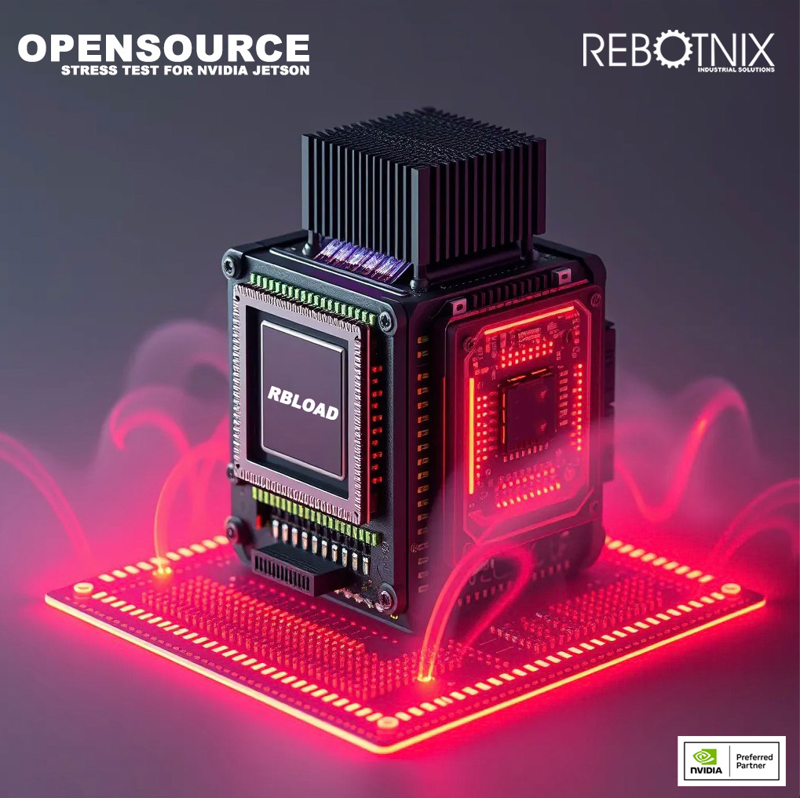
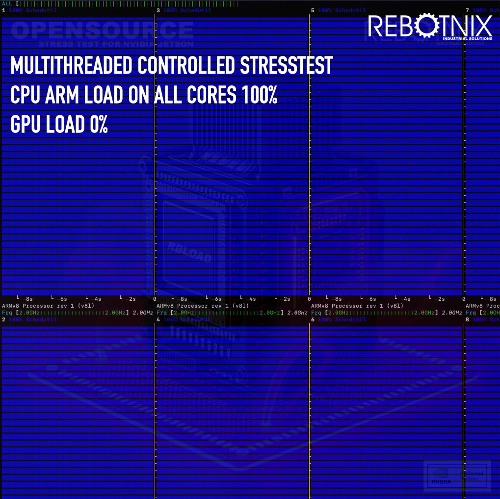
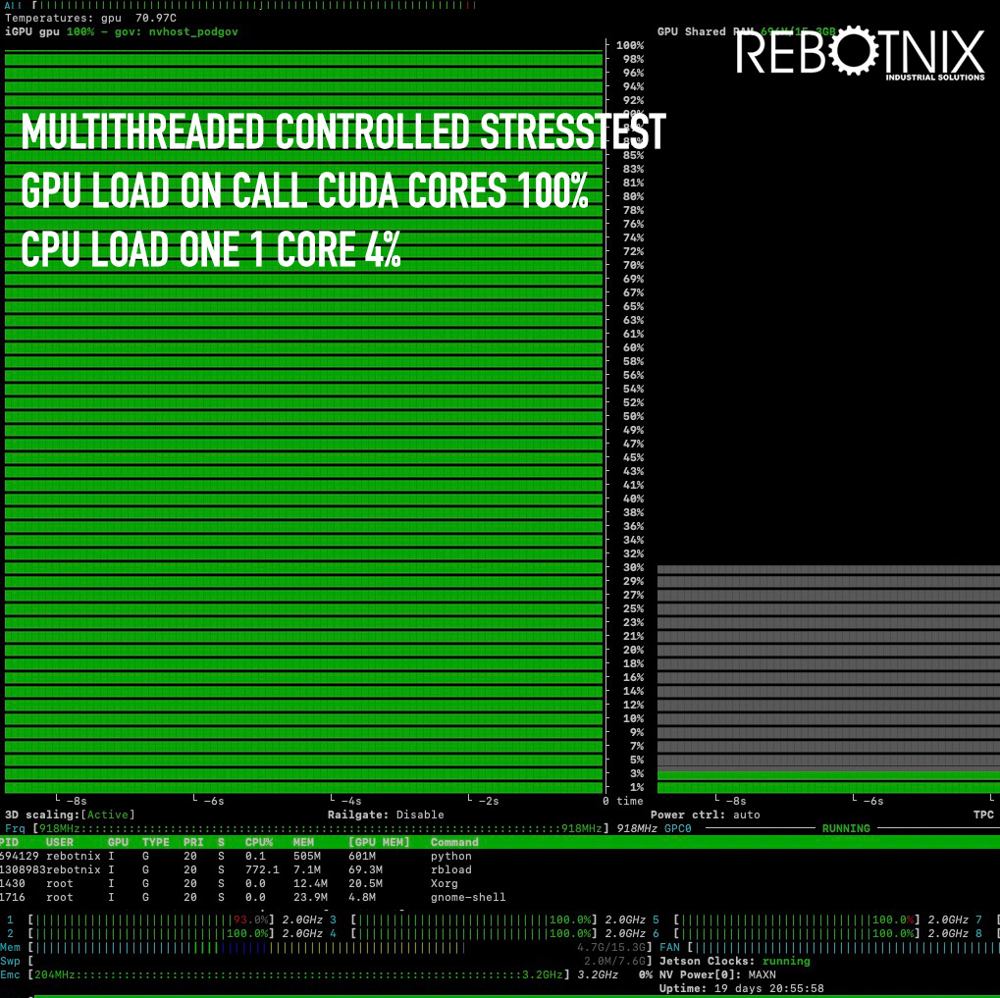
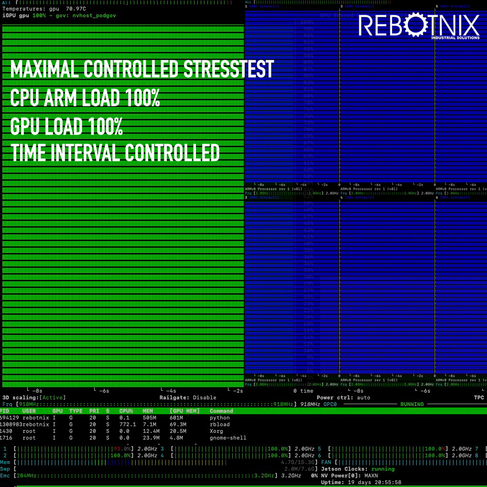
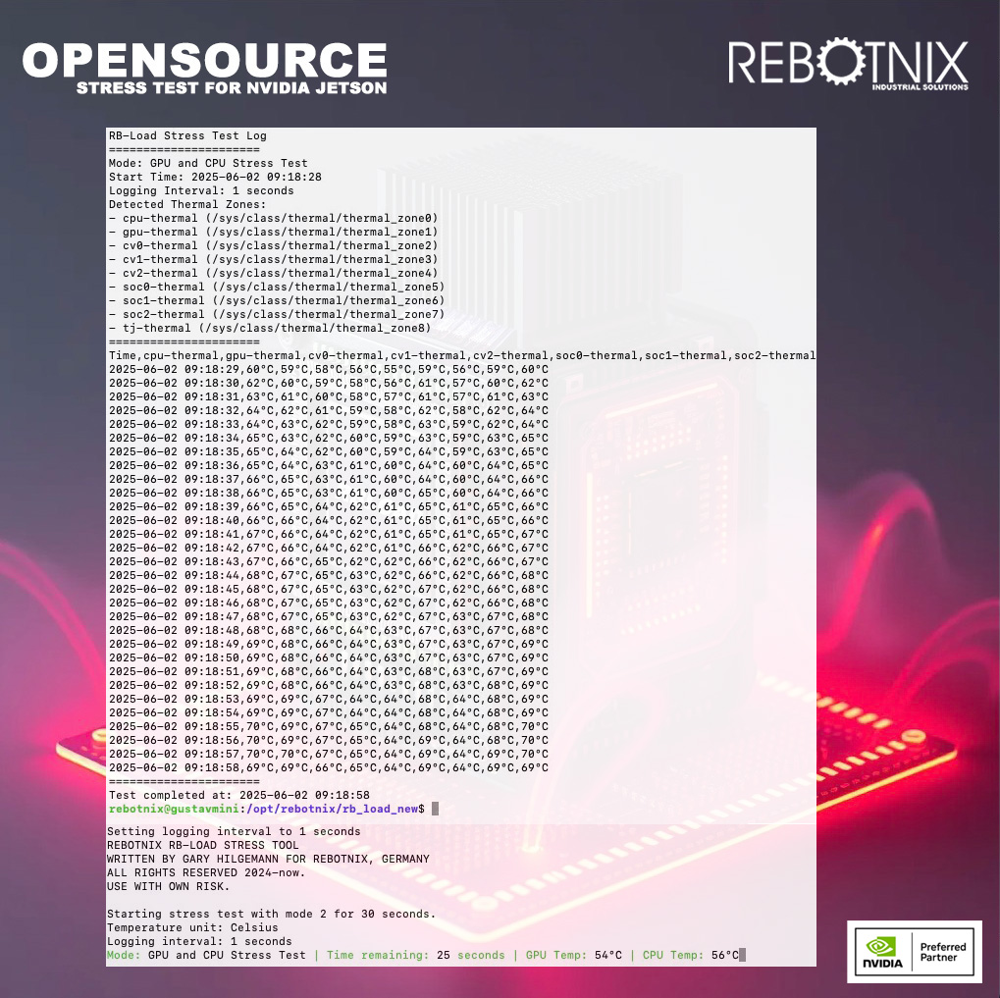

# REBOTNIX RB-LOAD Stresstest Documentation

## Overview
RB-LOAD is a software tool designed to stress-test high-performance computing systems, specifically those equipped with NVIDIA Tegra-based processors. It executes demanding computations on the GPU and/or CPU to assess the performance and stability under extreme workload conditions. The program also provides continuous monitoring of GPU and CPU temperatures, which is crucial for identifying thermal issues and potential overheating scenarios.

## Features
1. **GPU Stress Test**
   - Executes intensive computations on the GPU to test its performance capabilities and thermal response under load.
2. **CPU Stress Test**
   - Stresses all CPU cores with complex calculations to examine CPU performance and thermal characteristics.
3. **Combined GPU and CPU Stress Test**
   - Integrates both tests to provide a comprehensive assessment of the system’s performance under simulated peak load conditions.
4. **Temperature Monitoring**
   - Monitors and logs GPU and CPU temperatures in real-time during testing in celsius or fahrenheit.
5. **Logging**
   - Continuously logs temperature data and test results every 10 seconds to a file for later analysis, ensuring a detailed record of the system's performance and thermal conditions throughout the test.

## System Requirements
- **Operating System:** Linux, specifically developed for systems with NVIDIA Tegra processors (such as NVIDIA Jetson platforms).
- **Software Dependencies:** CUDA-capable GPU, CUDA Toolkit, and `tegrastats` for temperature monitoring.
- **Compiler:** G++ for C++17 or newer to compile the code.
- **Hardware:** NVIDIA GPU (for GPU-related tests), multi-core CPU.

## Installation and Configuration
1. **Install CUDA Toolkit**
   - Ensure the CUDA Toolkit is installed on your system to utilize GPU functionalities.
2. **Configure Compiler**
   - The source code must be compiled with a modern C++ compiler that supports C++17.
3. **Install tegrastats**
   - This tool should be installed on your system as it is used for monitoring temperature data.

## Usage
To start the program, execute it with optional command line arguments to specify the mode and duration of the test. 

rbload -m=[mode] -t=[duration] -stats=[true/false] -o=[output_file] -unit=[C/F]

Parameters:
-m=[mode]      : Test mode (0=CPU, 1=GPU, 2=Both)
-t=[duration]  : Test duration in seconds
-stats=[bool]  : Enable/disable temperature logging
-o=[filename]  : Output log file name
-unit=[C/F]    : Temperature unit (C=Celsius [default], F=Fahrenheit)

Example for CPU and GPU for 60 seconds in celsius log monitoring mode:
rbload -m=2 -t=60 -o=stress_test_log.txt -unit=C

## Tested
Jetson Orin NX 16 GB with Jetpack 6.1.1 [YES]
Jetson AGX ORIN 64GB with Jetpack 5.1.1 [YES]

More to come. Please report when you have find an valid test of this application.

## Safety Precautions
- **Monitoring:** Continuously monitor temperature and system performance to prevent damage due to overheating.
- **Use at Your Own Risk:** The software is powerful and can push hardware to its limits. Therefore, use is at your own risk.

## License
See LICENSE agreement.

